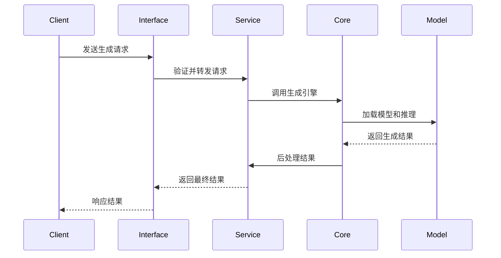
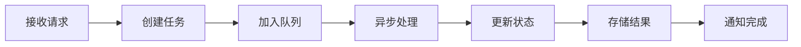

# Chara Forge 架构设计文档

## 1. 架构概述

Chara Forge 采用分层架构设计，将角色图片生成功能通过三个不同的接口层对外提供服务。整体架构遵循模块化、可扩展和高内聚低耦合的设计原则。

### 1.1 设计原则

- **分层架构**：清晰的层次结构，职责分离
- **模块化设计**：独立的功能模块，易于维护和扩展
- **接口标准化**：统一的 API 设计和错误处理
- **异步处理**：支持长时间运行的图片生成任务
- **可扩展性**：支持水平扩展和新模型集成

### 1.2 核心组件

```
┌─────────────────────────────────────────────────────────────────┐
│                        Chara Forge 系统架构                        │
├─────────────────────────────────────────────────────────────────┤
│                         接口层 (Interface Layer)                   │
│  ┌───────────────┐  ┌───────────────┐  ┌───────────────┐         │
│  │  Gradio Web   │  │  FastAPI      │  │  MCP Server   │         │
│  │  Interface    │  │  RESTful API  │  │  Protocol     │         │
│  │  (7860)       │  │  (8000)       │  │  (8001)       │         │
│  └───────────────┘  └───────────────┘  └───────────────┘         │
├─────────────────────────────────────────────────────────────────┤
│                         服务层 (Service Layer)                     │
│  ┌───────────────┐  ┌───────────────┐  ┌───────────────┐         │
│  │  Generation   │  │  Task Queue   │  │  Model        │         │
│  │  Service      │  │  Manager      │  │  Manager      │         │
│  │               │  │               │  │               │         │
│  └───────────────┘  └───────────────┘  └───────────────┘         │
├─────────────────────────────────────────────────────────────────┤
│                         核心层 (Core Layer)                        │
│  ┌───────────────┐  ┌───────────────┐  ┌───────────────┐         │
│  │  Character    │  │  Pipeline     │  │  Post         │         │
│  │  Generator    │  │  Manager      │  │  Processor    │         │
│  │  Engine       │  │               │  │               │         │
│  └───────────────┘  └───────────────┘  └───────────────┘         │
├─────────────────────────────────────────────────────────────────┤
│                         模型层 (Model Layer)                       │
│  ┌───────────────┐  ┌───────────────┐  ┌───────────────┐         │
│  │  SDXL Base    │  │  LoRA Models  │  │  ControlNet   │         │
│  │  Model        │  │  (Character)  │  │  Models       │         │
│  │               │  │               │  │               │         │
│  └───────────────┘  └───────────────┘  └───────────────┘         │
└─────────────────────────────────────────────────────────────────┘
```

## 2. 分层架构详解

### 2.1 接口层 (Interface Layer)

#### 2.1.1 Gradio Web Interface

**职责**：提供用户友好的 Web 界面

**技术实现**：
- 框架：Gradio 4.x
- 端口：7860
- 特性：实时预览、历史记录、批量生成

**核心组件**：
```python
# chara_forge/web/app.py
class GradioApp:
    def __init__(self):
        self.generator = CharacterGenerator()
        self.interface = self._create_interface()
    
    def _create_interface(self):
        return gr.Interface(
            fn=self.generate_character,
            inputs=[
                gr.Textbox(label="角色描述"),
                gr.Dropdown(choices=["anime", "cartoon", "realistic"], label="风格"),
                gr.Slider(minimum=1, maximum=8, label="生成数量")
            ],
            outputs=gr.Gallery(label="生成结果")
        )
```

#### 2.1.2 FastAPI RESTful API

**职责**：提供标准的 REST API 接口

**技术实现**：
- 框架：FastAPI 0.104+
- 端口：8000
- 特性：异步处理、WebSocket 支持、API 文档

**核心端点**：
```python
# chara_forge/api/routes/generate.py
@router.post("/generate/character")
async def generate_character(request: CharacterRequest):
    task_id = await task_manager.create_task(request)
    return {"task_id": task_id, "status": "pending"}

@router.get("/tasks/{task_id}/status")
async def get_task_status(task_id: str):
    return await task_manager.get_task_status(task_id)

@router.get("/tasks/{task_id}/result")
async def get_task_result(task_id: str):
    return await task_manager.get_task_result(task_id)
```

#### 2.1.3 MCP Server Protocol

**职责**：提供 MCP 协议支持，与 AI 助手无缝集成

**技术实现**：
- 框架：MCP Python SDK
- 端口：8001
- 特性：工具调用、资源管理、错误处理

**工具定义**：
```python
# chara_forge/mcp/server.py
@mcp.tool()
async def generate_character(
    prompt: str,
    style: str = "anime",
    size: str = "768x768"
) -> Dict[str, Any]:
    """生成游戏角色图片"""
    result = await character_generator.generate(
        prompt=prompt,
        style=style,
        size=size
    )
    return result
```

### 2.2 服务层 (Service Layer)

#### 2.2.1 Generation Service

**职责**：角色生成服务的统一入口

**核心功能**：
- 请求验证和预处理
- 参数标准化
- 结果格式化
- 错误处理和重试

```python
# chara_forge/services/generation_service.py
class GenerationService:
    def __init__(self):
        self.generator = CharacterGenerator()
        self.validator = RequestValidator()
        self.post_processor = PostProcessor()
    
    async def generate_character(self, request: CharacterRequest) -> GenerationResult:
        # 参数验证
        validated_request = self.validator.validate(request)
        
        # 生成处理
        raw_result = await self.generator.generate(validated_request)
        
        # 后处理
        processed_result = self.post_processor.process(raw_result)
        
        return processed_result
```

#### 2.2.2 Task Queue Manager

**职责**：管理异步任务队列和状态

**技术实现**：
- 任务队列：Redis + Celery
- 状态管理：Redis
- 并发控制：信号量机制

```python
# chara_forge/services/task_manager.py
class TaskManager:
    def __init__(self):
        self.redis_client = redis.Redis()
        self.celery_app = celery.Celery()
    
    async def create_task(self, request: CharacterRequest) -> str:
        task_id = str(uuid.uuid4())
        await self.redis_client.hset(
            f"task:{task_id}",
            mapping={"status": "pending", "request": request.json()}
        )
        self.celery_app.send_task("generate_character", args=[task_id])
        return task_id
    
    async def get_task_status(self, task_id: str) -> TaskStatus:
        task_data = await self.redis_client.hgetall(f"task:{task_id}")
        return TaskStatus(**task_data)
```

#### 2.2.3 Model Manager

**职责**：管理 AI 模型的加载、卸载和切换

**核心功能**：
- 模型生命周期管理
- 内存优化
- 模型预热和缓存

```python
# chara_forge/services/model_manager.py
class ModelManager:
    def __init__(self):
        self.loaded_models = {}
        self.model_configs = load_model_configs()
    
    async def load_model(self, model_name: str) -> torch.nn.Module:
        if model_name not in self.loaded_models:
            model = await self._load_model_from_disk(model_name)
            self.loaded_models[model_name] = model
        return self.loaded_models[model_name]
    
    async def unload_model(self, model_name: str):
        if model_name in self.loaded_models:
            del self.loaded_models[model_name]
            torch.cuda.empty_cache()
```

### 2.3 核心层 (Core Layer)

#### 2.3.1 Character Generator Engine

**职责**：核心的角色生成引擎

**技术实现**：
- 深度学习框架：PyTorch
- 推理加速：TensorRT、DeepSpeed
- 模型支持：SDXL、LoRA、ControlNet

```python
# chara_forge/core/generator.py
class CharacterGenerator:
    def __init__(self):
        self.pipeline = StableDiffusionXLPipeline.from_pretrained(
            "stabilityai/stable-diffusion-xl-base-1.0"
        )
        self.device = torch.device("cuda" if torch.cuda.is_available() else "cpu")
        self.pipeline.to(self.device)
    
    async def generate(self, request: GenerationRequest) -> GenerationResult:
        # 构建提示词
        prompt = self._build_prompt(request)
        
        # 生成图片
        images = self.pipeline(
            prompt=prompt,
            negative_prompt=request.negative_prompt,
            width=request.width,
            height=request.height,
            num_images_per_prompt=request.num_images,
            guidance_scale=request.guidance_scale,
            num_inference_steps=request.steps,
            generator=torch.Generator().manual_seed(request.seed)
        ).images
        
        return GenerationResult(images=images, metadata=metadata)
```

#### 2.3.2 Pipeline Manager

**职责**：管理不同的生成管道和模型组合

**核心功能**：
- 管道配置和切换
- 模型组合优化
- 推理参数调优

```python
# chara_forge/core/pipeline_manager.py
class PipelineManager:
    def __init__(self):
        self.pipelines = {}
        self.current_pipeline = None
    
    def get_pipeline(self, style: str) -> StableDiffusionXLPipeline:
        if style not in self.pipelines:
            self.pipelines[style] = self._create_pipeline(style)
        return self.pipelines[style]
    
    def _create_pipeline(self, style: str) -> StableDiffusionXLPipeline:
        base_model = "stabilityai/stable-diffusion-xl-base-1.0"
        pipeline = StableDiffusionXLPipeline.from_pretrained(base_model)
        
        # 加载风格特定的 LoRA
        if style in self.lora_configs:
            pipeline.load_lora_weights(self.lora_configs[style])
        
        return pipeline
```

#### 2.3.3 Post Processor

**职责**：对生成的图片进行后处理

**核心功能**：
- 图片质量优化
- 背景移除
- 尺寸调整
- 格式转换

```python
# chara_forge/core/post_processor.py
class PostProcessor:
    def __init__(self):
        self.upscaler = RealESRGANUpscaler()
        self.background_remover = BackgroundRemover()
    
    def process(self, images: List[PIL.Image]) -> List[PIL.Image]:
        processed_images = []
        
        for image in images:
            # 超分辨率增强
            enhanced = self.upscaler.enhance(image)
            
            # 背景移除（可选）
            if self.config.remove_background:
                enhanced = self.background_remover.remove(enhanced)
            
            processed_images.append(enhanced)
        
        return processed_images
```

### 2.4 模型层 (Model Layer)

#### 2.4.1 SDXL Base Model

**职责**：基础的 Stable Diffusion XL 模型

**技术规格**：
- 模型：stabilityai/stable-diffusion-xl-base-1.0
- 参数量：6.6B
- 输入分辨率：512x512 到 1024x1024
- 推理时间：10-20 秒/张（GPU）

#### 2.4.2 LoRA Models

**职责**：提供特定风格的低秩适应模型

**支持的 LoRA 模型**：
- `anime-character-lora`：动漫风格角色
- `pixel-art-lora`：像素艺术风格
- `cartoon-character-lora`：卡通风格角色
- `realistic-portrait-lora`：写实人像风格

#### 2.4.3 ControlNet Models

**职责**：提供姿势和构图控制

**支持的 ControlNet**：
- `controlnet-openpose`：人体姿势控制
- `controlnet-depth`：深度信息控制
- `controlnet-canny`：边缘检测控制

## 3. 数据流设计

### 3.1 请求处理流程



### 3.2 异步任务处理



### 3.3 数据存储结构

```yaml
# Redis 数据结构
task:{task_id}:
  status: "pending|processing|completed|failed"
  request: JSON
  result: JSON
  created_at: timestamp
  updated_at: timestamp
  
# 文件系统结构
/data/
├── models/          # 模型文件
│   ├── base/
│   ├── lora/
│   └── controlnet/
├── cache/           # 缓存文件
├── outputs/         # 生成结果
│   ├── images/
│   └── metadata/
└── logs/           # 日志文件
```

## 4. 部署架构

### 4.1 单机部署

```yaml
# docker-compose.yml
version: '3.8'
services:
  chara-forge:
    image: chara-forge:latest
    ports:
      - "7860:7860"  # Gradio
      - "8000:8000"  # FastAPI
      - "8001:8001"  # MCP
    volumes:
      - ./models:/app/models
      - ./outputs:/app/outputs
    environment:
      - CUDA_VISIBLE_DEVICES=0
      - MODEL_PATH=/app/models
    deploy:
      resources:
        reservations:
          devices:
            - driver: nvidia
              count: 1
              capabilities: [gpu]
```

### 4.2 分布式部署

```yaml
# 分布式架构
┌─────────────────┐    ┌─────────────────┐    ┌─────────────────┐
│   Load Balancer │    │   API Gateway   │    │   Web Frontend  │
│     (Nginx)     │    │    (Kong)       │    │     (React)     │
└─────────────────┘    └─────────────────┘    └─────────────────┘
         │                       │                       │
         └───────────────────────┼───────────────────────┘
                                 │
         ┌───────────────────────┼───────────────────────┐
         │                       │                       │
┌─────────────────┐    ┌─────────────────┐    ┌─────────────────┐
│  API Server 1   │    │  API Server 2   │    │  API Server N   │
│   (FastAPI)     │    │   (FastAPI)     │    │   (FastAPI)     │
└─────────────────┘    └─────────────────┘    └─────────────────┘
         │                       │                       │
         └───────────────────────┼───────────────────────┘
                                 │
                    ┌─────────────────┐
                    │   Message Queue │
                    │     (Redis)     │
                    └─────────────────┘
                                 │
         ┌───────────────────────┼───────────────────────┐
         │                       │                       │
┌─────────────────┐    ┌─────────────────┐    ┌─────────────────┐
│  Worker Node 1  │    │  Worker Node 2  │    │  Worker Node N  │
│   (GPU + AI)    │    │   (GPU + AI)    │    │   (GPU + AI)    │
└─────────────────┘    └─────────────────┘    └─────────────────┘
```

## 5. 安全架构

### 5.1 认证授权

```python
# chara_forge/security/auth.py
class AuthenticationService:
    def __init__(self):
        self.jwt_secret = os.getenv("JWT_SECRET")
        self.api_keys = self._load_api_keys()
    
    def verify_api_key(self, api_key: str) -> bool:
        return api_key in self.api_keys
    
    def verify_jwt_token(self, token: str) -> Optional[dict]:
        try:
            payload = jwt.decode(token, self.jwt_secret, algorithms=["HS256"])
            return payload
        except jwt.InvalidTokenError:
            return None
```

### 5.2 内容安全

```python
# chara_forge/security/content_filter.py
class ContentFilter:
    def __init__(self):
        self.nsfw_detector = NSFWDetector()
        self.text_filter = TextFilter()
    
    def filter_prompt(self, prompt: str) -> FilterResult:
        # 文本内容过滤
        if self.text_filter.is_inappropriate(prompt):
            return FilterResult(allowed=False, reason="inappropriate_content")
        
        return FilterResult(allowed=True)
    
    def filter_image(self, image: PIL.Image) -> FilterResult:
        # 图片内容检测
        nsfw_score = self.nsfw_detector.predict(image)
        if nsfw_score > 0.7:
            return FilterResult(allowed=False, reason="nsfw_content")
        
        return FilterResult(allowed=True)
```

### 5.3 速率限制

```python
# chara_forge/security/rate_limiter.py
class RateLimiter:
    def __init__(self):
        self.redis_client = redis.Redis()
        self.limits = {
            "free": {"requests": 10, "window": 3600},
            "premium": {"requests": 100, "window": 3600}
        }
    
    async def check_rate_limit(self, user_id: str, plan: str) -> bool:
        key = f"rate_limit:{user_id}:{plan}"
        current = await self.redis_client.get(key)
        
        if current is None:
            await self.redis_client.setex(key, self.limits[plan]["window"], 1)
            return True
        
        if int(current) >= self.limits[plan]["requests"]:
            return False
        
        await self.redis_client.incr(key)
        return True
```

## 6. 监控与日志

### 6.1 性能监控

```python
# chara_forge/monitoring/metrics.py
class MetricsCollector:
    def __init__(self):
        self.prometheus_client = PrometheusClient()
        self.generation_counter = Counter('character_generations_total')
        self.generation_duration = Histogram('character_generation_duration_seconds')
    
    def record_generation(self, duration: float, success: bool):
        self.generation_counter.labels(status="success" if success else "failure").inc()
        self.generation_duration.observe(duration)
```

### 6.2 日志管理

```python
# chara_forge/logging/logger.py
class StructuredLogger:
    def __init__(self):
        self.logger = structlog.get_logger()
    
    def log_generation_request(self, request_id: str, prompt: str, style: str):
        self.logger.info(
            "generation_request",
            request_id=request_id,
            prompt=prompt,
            style=style,
            timestamp=datetime.utcnow().isoformat()
        )
    
    def log_generation_result(self, request_id: str, success: bool, duration: float):
        self.logger.info(
            "generation_result",
            request_id=request_id,
            success=success,
            duration=duration,
            timestamp=datetime.utcnow().isoformat()
        )
```

## 7. 扩展点设计

### 7.1 模型插件系统

```python
# chara_forge/plugins/model_plugin.py
class ModelPlugin(ABC):
    @abstractmethod
    async def load_model(self) -> torch.nn.Module:
        pass
    
    @abstractmethod
    async def generate(self, prompt: str, **kwargs) -> PIL.Image:
        pass
    
    @abstractmethod
    def get_supported_styles(self) -> List[str]:
        pass

# 插件注册
class PluginRegistry:
    def __init__(self):
        self.plugins = {}
    
    def register_plugin(self, name: str, plugin: ModelPlugin):
        self.plugins[name] = plugin
    
    def get_plugin(self, name: str) -> ModelPlugin:
        return self.plugins.get(name)
```

### 7.2 风格扩展

```python
# chara_forge/styles/style_manager.py
class StyleManager:
    def __init__(self):
        self.styles = self._load_styles()
    
    def _load_styles(self) -> Dict[str, StyleConfig]:
        styles = {}
        for style_file in glob.glob("configs/styles/*.yaml"):
            with open(style_file) as f:
                style_config = yaml.safe_load(f)
                styles[style_config["name"]] = StyleConfig(**style_config)
        return styles
    
    def get_style_config(self, style_name: str) -> StyleConfig:
        return self.styles.get(style_name)
```

## 8. 性能优化

### 8.1 模型优化

- **量化加速**：使用 8-bit 量化减少内存使用
- **推理优化**：TensorRT、ONNX 运行时优化
- **模型剪枝**：移除不必要的模型参数
- **动态批处理**：自动调整批处理大小

### 8.2 缓存策略

```python
# chara_forge/cache/cache_manager.py
class CacheManager:
    def __init__(self):
        self.redis_client = redis.Redis()
        self.ttl = 3600  # 1小时
    
    async def get_cached_result(self, prompt_hash: str) -> Optional[GenerationResult]:
        cached_data = await self.redis_client.get(f"cache:{prompt_hash}")
        if cached_data:
            return GenerationResult.from_json(cached_data)
        return None
    
    async def cache_result(self, prompt_hash: str, result: GenerationResult):
        await self.redis_client.setex(
            f"cache:{prompt_hash}",
            self.ttl,
            result.to_json()
        )
```

### 8.3 内存管理

```python
# chara_forge/memory/memory_manager.py
class MemoryManager:
    def __init__(self):
        self.memory_threshold = 0.8  # 80% 内存使用率
    
    def check_memory_usage(self) -> float:
        return torch.cuda.memory_allocated() / torch.cuda.max_memory_allocated()
    
    def cleanup_memory(self):
        if self.check_memory_usage() > self.memory_threshold:
            torch.cuda.empty_cache()
            gc.collect()
```

## 9. 测试策略

### 9.1 单元测试

```python
# tests/test_generator.py
class TestCharacterGenerator:
    def setup_method(self):
        self.generator = CharacterGenerator()
    
    async def test_generate_character(self):
        request = GenerationRequest(
            prompt="anime girl",
            style="anime",
            width=512,
            height=512
        )
        
        result = await self.generator.generate(request)
        
        assert result.success
        assert len(result.images) > 0
        assert result.images[0].size == (512, 512)
```

### 9.2 集成测试

```python
# tests/test_api.py
class TestAPI:
    def setup_method(self):
        self.client = TestClient(app)
    
    def test_generate_character_endpoint(self):
        response = self.client.post("/api/v1/generate/character", json={
            "prompt": "fantasy warrior",
            "style": "cartoon",
            "width": 768,
            "height": 768
        })
        
        assert response.status_code == 200
        assert "task_id" in response.json()
```

### 9.3 性能测试

```python
# tests/test_performance.py
class TestPerformance:
    async def test_generation_speed(self):
        start_time = time.time()
        
        result = await self.generator.generate(self.test_request)
        
        end_time = time.time()
        duration = end_time - start_time
        
        assert duration < 20.0  # 20 秒内完成
        assert result.success
```

## 10. 部署与运维

### 10.1 持续集成

```yaml
# .github/workflows/ci.yml
name: CI/CD Pipeline

on:
  push:
    branches: [ main, develop ]
  pull_request:
    branches: [ main ]

jobs:
  test:
    runs-on: ubuntu-latest
    steps:
    - uses: actions/checkout@v3
    - name: Set up Python
      uses: actions/setup-python@v4
      with:
        python-version: '3.12'
    - name: Install dependencies
      run: |
        pip install uv
        uv sync --dev
    - name: Run tests
      run: |
        make test
    - name: Run linting
      run: |
        make lint
```

### 10.2 容器化部署

```dockerfile
# Dockerfile
FROM nvidia/cuda:11.8-runtime-ubuntu22.04

WORKDIR /app

# 安装系统依赖
RUN apt-get update && apt-get install -y \
    python3.12 \
    python3-pip \
    git \
    && rm -rf /var/lib/apt/lists/*

# 安装 Python 依赖
COPY requirements.txt .
RUN pip install -r requirements.txt

# 复制应用代码
COPY . .

# 暴露端口
EXPOSE 7860 8000 8001

# 启动命令
CMD ["python", "-m", "chara_forge.main"]
```

### 10.3 监控配置

```yaml
# monitoring/prometheus.yml
global:
  scrape_interval: 15s

scrape_configs:
  - job_name: 'chara-forge'
    static_configs:
      - targets: ['localhost:8000']
    metrics_path: '/metrics'
    scrape_interval: 5s
```

这个架构设计文档提供了 Chara Forge 系统的完整技术蓝图，涵盖了从接口设计到部署运维的各个方面，为开发团队提供了清晰的技术指导。